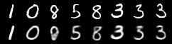

# VAE with Gumbel-Softmax in Pytorch

Pytorch implementation of a Variational Autoencoder with Gumbel-Softmax Distribution. Refer to the following paper:

* [Categorical Reparametrization with Gumbel-Softmax](https://arxiv.org/pdf/1611.01144.pdf) by Jang, Gu and Poole


## Table of Contents
* [Installation](#installation)
* [Ananconda](#anaconda)
* [Results](#results)

## Installation

The program requires the following dependencies (easy to install using pip or Ananconda):

* python 2.7/3.5
* pytorch (version 0.3.1)
* numpy


### Anaconda: Train

Train VAE-Gumbel-Softmax model on the local machine using MNIST dataset:

```python
python vae_gumbel_softmax.py
```

## Results

### Hyperparameters
```python
Batch Size:                         128
Learning Rate:                      0.0001
Initial Temperature:                1.0
Minimum Temperature:                0.5
Anneal Rate:                        0.00003
Learnable Temperature:              False
```

### MNIST
| Ground Truth/Reconstructions 	    |     Generated Samples	|
|:--------------------------------: |:-------------------------:|
| | |
